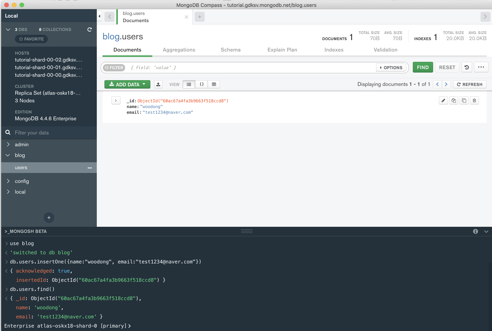

# MongoDB 맛보기


### 1. MongoDB 설정하기

- 몽고DB에서 무료로 개발할 수 있도록 MongoDB Atlas( 클라우드 서비스 )를 제공합니다.
  - ` https://www.mongodb.com/` : 가입하기
  - Project 생성
  - Cluster 생성 : 내가 만든 몽고DB Server
    - builder a Cluster => FREE ( 무료버전 선택 ) => AWS ( 싱가폴 ) 선택 => Cluster name 설정 => 생성하기


### 2. 데이터베이스 생성 및 연결하기

- 데이터 베이스 서버 연결하기 
  - Clusters => CONNECT ( 2가지 설정 필요 )
    - 접속 IP 설정하기 ( Allow Access from Anywher = 0.0.0.0/0 ) => 모든 IP 접속 허용
    - 계정 설정
  - 설정 완료 후 **Choose a connection method** 클릭
    - 터미널 창 접속 방법
    - Application에서 접속 방법 ( Node.js 등 )
    - **MongoDB에서 제공주는 GUI를 통해 접속 방법 ( 선택하기 )**
      - 운영체제 설정 후 **다운로드** 하기
      - 실행 후 connection string( 비밀번호 넣기 )을 복사 후 붙여넣기를 통해 연결을 진행합니다.
      - 연결이 완료되면 DB가 3개 존재(admin, config, local) => 설정에 관련된 것들이니 그대로 유지합니다.


### 3. 설치한 MongoDB Compass 다루기

- 하단에 **MongoSH Beta**를 통해 터미널로 접속 가능합니다.
- `db`라고 입력하면 `test`가 출력됩니다. ( 기본 DB )
- `use name`으로 DB를 생성할 수 있다.
  - GUI에 반영되는 것은 Data가 존재하면 반영됩니다.
- data 생성 : `db.users.insertOne({name:"woodong", email:"test1234@naver.com"})`
- 조회 : `db.users.find()` ( 여러개 불러오기 )
- `ObjectId` : 몽고DB에서 자동으로 생성해주는 유니크 Key 입니다.




- Schemaless 특성
  - 몽고DB는 JSON(객체)를 그대로 저장합니다.
    - 사실은 저장할 때에는 다른 방식이 존재합니다.
  - 관계형 DB와는 다르게 다른 양식의 데이터가 들어와도 저장이 됩니다.
    - 객체안의 객체, 배열 등이 올 수 있다.


### 4. update Document

- 데이터 한개를 골라 수정하기

  - `db.users.updateOne({},{})`

    - 첫번째 인자 : 전체 데이터 중에 어떤 것을 수정할지
    - 두번째 인자 : 선택한 데이터에서 어떤 부분을 수정할지

  - `db.users.updateOne({name:'woodong'},{$set:{age:30}})` : **새로운 것 추가**

  - `db.users.findOne({name:"woodong"})`

    - 결과

    ```
    { _id: ObjectId("60ac67a4fa3b9663f518ccd8"),
      name: 'woodong',
      email: 'test1234@naver.com',
      age: 30 }
    ```


### 5. update nested document

- 기존 데이터를 수정
  - `db.users.updateOne({"name.first": "woo"}, {$set: {"name.last": "woo2"}})`


### 6. Update with ObjectID

- 고유한 값인 ObjectID를 통해 검색하고 업데이트하는 것이 좋습니다.

- `db.users.findOne({_id: ObjectId("60ac67a4fa3b9663f518ccd8")})`
- `db.users.updateOne({_id: ObjectId("60ac67a4fa3b9663f518ccd8")}, { $inc:{age:1}})`
  - inc : 값 하나 증가시키기


### 7. Delete document

- `db.users.deleteOne({_id: ObjectId('60ae7d2b107fd005c94c0535')})`


### 8. Database의 구조

- database ( 하나의 데이터베이스를 의미 )
- collection ( 테이블를 의미 )
- document ( 각각의 데이터를 의미 )
