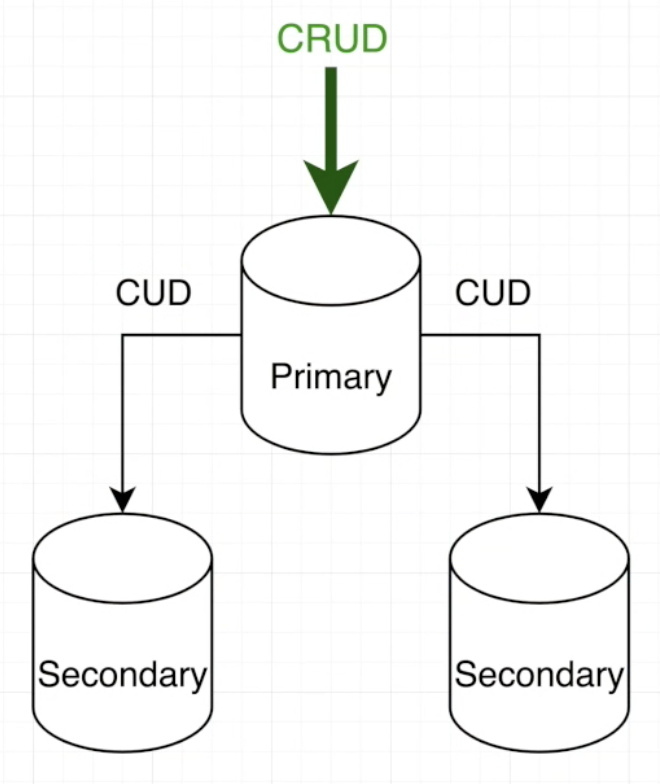

# 무중단 서비스 & 확장성 그리고 관계형 데이터베이스(RDS)와 비교하기

- DataBase가 응답시간이 느려지거나 일시적으로 다운되면 Backend의 기능이 아무리 좋아도 Frontend로 가는 데이터는 장애를 얻게 됩니다.

### 1. Replica Set

- 아틀라스는 기본으로 3개의 서버를 만듭니다.
  - Primary + Secondary + Secondary
  - 우리가 CRUD 작업은 모두 Primary로 가고 비동기로 Secondary의 저장공간에 저장이 됩니다.
  - 만약에 어떤 문제로 Primary 서버가 죽ㅇ면 Secondary가 승급이 되면서 Primary로 올라갑니다. ( 무중단 서비스 )
- 어떠한 DB에서도 적용할 수 있지만 몽고DB는 아틀라스에서 디폴트로 알아서 적용해줍니다!
- 또 우리가 새로운 버전이 생겨서 DB업데이트를 할 경우 Secondary를 먼저 업데이트 하고 승급시키고 Primary를 업데이트 하든 무중단으로 가능하게 됩니다!
  - 원래는 DB를 업데이트할 경우 서버가 죽게되버리는 경우가 있다.

### 2. 수평확장

- 보통 확장성에서 제일 기본은 DB를 잘 설계하고 내장을 잘하고 Populate를 잘 활용하는 것이 기본입니다.
  - index 및 page 처리 등 포함
  - 서버 사양이 뛰어나지 않아도 충분하게 사용할 수 있습니다.
  - 기본을 지키지 못하고 사양만 올리면 한계가 있다. ( 비용만 올라가게 된다. )
- 위의 다양한 부분을을 적용했어도 데이터가 너무 많아 느려질 수도 있습니다. 이럴 경우 비용을 지불해서 서버 사양을 올려야 합니다.
- 수직 확장
  - CPU, RAN 등 더 좋은 사양을 활용하는 것입니다.
  - 하지만 한계가 존재합니다.
    - CPU CORE를 무한정으로 늘릴 수 없다.
- 수평 확장
  - 비슷한 사양의 서버를 여러개 두는 것입니다.
  - 데이터가 3억개가 있으면 1억개는 다른 곳에, 1억개는 다른 곳에 이렇게 분산되서 저장하게 됩니다.
  - 수평 확장은 무한으로 추가할 수 있다. ( 한계가 없다. )
  - Sharded Cluster : Replica Set을 여러대 두는 것!
    - 관계형 데이터 베이스도 가능하지만 매우 기술적으로 어렵다!
      - 여러 관계를 가지고 데이터를 최대한 정규화 해놓고 분산시켜 놓고 그것을 쿼리를 통해 join을 이용해서 가공을 한 후 읽게 되는데 데이터가 분산 되어 있으면 매우 기술적으로 어려운 부분이 있다.
    - 예전에는 수직확장으로 해결할 수 있다고 생각해서 설계가 잘 되어 있지 않았다.

### 3. ObjectId vs Auto Increment

- ObjectId 구성 : 12 바이트
  - 4바이트 : 시간
  - 5바이트 : 랜덤 숫자
  - 3바이트 : Increment 및 랜덤 숫자
    - 특징 : 랜덤한 숫자!
- 관계형 데이터 베이스에서는 key를 보통 int를 사용하게 되고 auto increment를 활용하게 됩니다.
  - 문제점 : 단일 서버에서는 상관이 없지만 수평확장을 할 경우 문제가 발생하게 됩니다.
    - 서버가 분산되면서 데이터가 저장될 때 고유키가 중복이 될 수 있기 때문입니다.
    - 또 URL를 통해 총 회원이 몇개인지, 게시글이 몇개인지 유추할 수 있다!
- **몽고디비는 중복될 일이 없어서 유니크처리가 매우 수월하다!**
  - URL를 통해 어떠한 정보인지 유추할 수 없다!
  - ObjectId에는 time이 들어있기 때문에 이것을 기준으로 정렬해도 가능하다!

### 4. 관계형 데이터베이스와 비교하기

- 몽고DB는 통째로 가공된 데이터가 저장되어서 빠르게 읽을 수 있습니다.
  - 하지만 read가 자주 바뀔 경우 단점이 있다.
    - 저장할 때 처리를 많이 해줘야 하니까...( 내장하기 위해 )
    - 하지만 관계형은 read가 자주 바껴도 아주 쉽게 적용할 수 있다.
- 관계형 DB는 관계된 데이터를 다 가져오기 위해 반복적인 작업을 계속 수행합니다.
  - 이 문제를 해결하기 위해 쿼리문과 결과값을 메모리와 캐시에 저장하고 똑같은 호출이 올 경우 캐시를 사용합니다.
    - 서버사이드 캐싱
    - 데이터가 바뀔 경우 캐쉬를 초기화 해야 하는 등 기술적인 부분이 어렵고 확장성도 떨어지게 된다.
  - 예 ) 레디스

- 몽고디비에서 Aggregate가 존재합니다.
  - SQL과 같은 기능( JOIN 등 ), 몽고디비전용 SQL 기능
- READ Performance
  - Nesting >>> SQL >>> Aggregate
- READ Flexibility ( 읽는 데이터들의 자주 수정하는 빈도 )
  - SQL, Aggregate >>> Nesting
- 결론 : **READ Flexibility의 빈도가 높으면 Aggregate를 사용하면 된다!!**

### 5. Replica Set 심화 기능

- Secondary에서 읽기를 또 가능하게 할 수 있습니다. ( 확장성 )
  - 보통은 대부분 Primary에서 CRUD의 작업을 모두 처리합니다.
  - 비동기 작업으로 Secondary를 업데이트 하기 때문에 일관성 문제가 생길 수 있다. ( 읽기 )
- 그래서 Aggregate 경우 주기적으로 사고 실시간성이 떨어지기 때문에 Secondary에 연결해서 할 수 있습니다.

### 6. 몽고디비의 단점?

- 2가지를 써야한다는 것이 단점( 일반 쿼리, Aggregate)
- 관계형 데이터 베이스는 정석이 존재합니다. ( 정규화 )
- 몽고 디비는 관계가 있어도 상황에 따라서 nesting or popluate를 활용해야 합니다.
  - 개발자의 경험과 노하우가 필요합니다.
- 데이터를 입력할 때 차이점이 있습니다.
  - 관계형은 정규화가 되어있기 때문에 그냥 넣어주면 됩니다.
    - 그냥 자동으로 일관성 보장...
    - 몽고디비는 내장한 부분에 대해서는 넣어주고 업데이트를 해줘야 일관성을 보장할 수 있다.
      - 개발자가 일관성을 보장하기 위해 노력해야 합니다.
- 몽고디비는 CUD가 복잡하고 READ는 간편하다.
  - 여기서 과부하가 걸릴 수도 있는 부분 => 수평확장, 수직확장 등을 통해 해결!
- 관계형은 CUD가 간단하고 READ 부분에서 훨신 복잡하고 관계가 많다.
- 몽고디비를 제대로 사용하면 더 퍼포먼스를 보여줄 수 있다!!!

